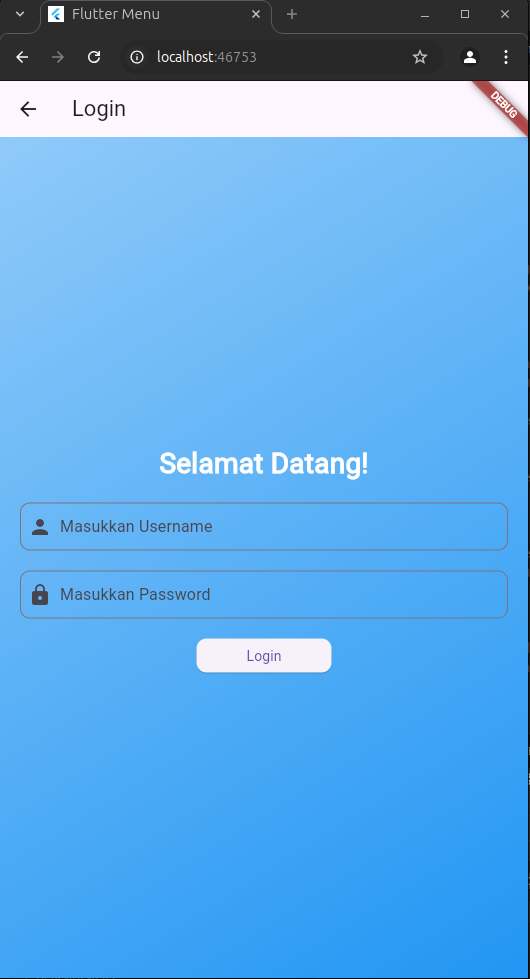
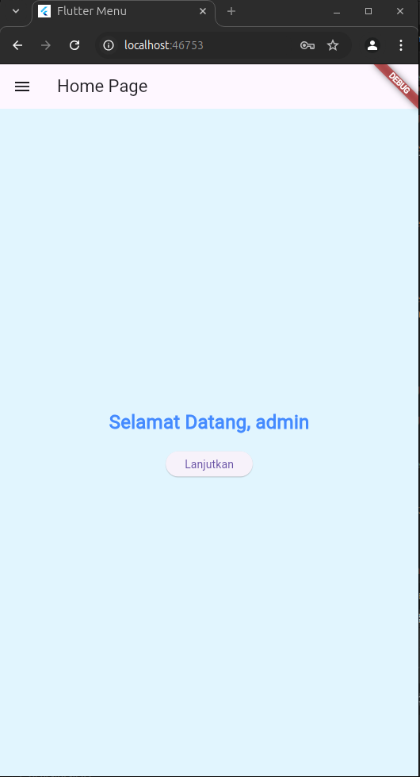
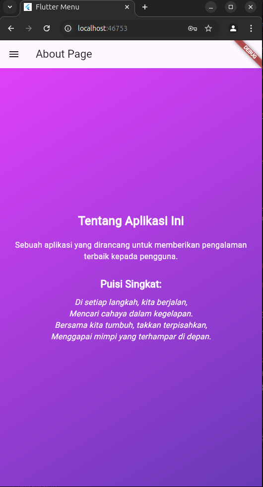
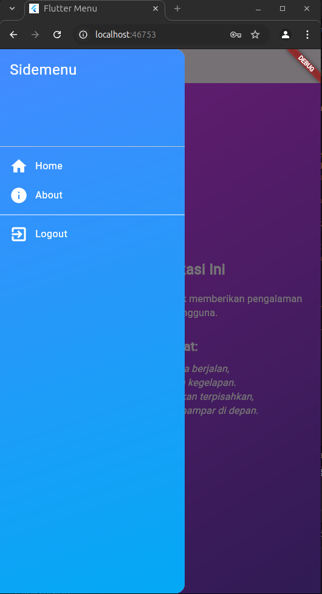

# pertemuan3

# File main.dart
main():

    Fungsi utama yang menjalankan aplikasi dengan memanggil runApp() untuk menampilkan widget MyApp sebagai root aplikasi.

MyApp:

    StatelessWidget: Komponen ini tidak berubah selama siklus hidupnya.
    build(): Metode ini membangun UI aplikasi dengan mengembalikan widget MaterialApp.
    
MaterialApp:

    title: Menetapkan judul aplikasi.
    home: Menunjukkan halaman utama yang pertama kali ditampilkan, dalam hal ini adalah LoginPage.

# File login_page.dart
saveUserName():

    Menyimpan username ke dalam SharedPreferences untuk digunakan di halaman lain.

_showInput():

    Fungsi ini membuat widget TextField untuk input username dan password, dengan ikon yang berbeda untuk setiap jenis input (ikon person untuk username dan lock untuk password).

_showDialog():

    Menampilkan dialog konfirmasi dengan pesan khusus, dan ketika ditekan "OK", pengguna akan diarahkan ke halaman yang diberikan sebagai argumen (HomePage atau LoginPage).

build():

    Bagian utama yang membangun tampilan halaman login. Mengatur tata letak (dengan gradien warna), menampilkan input untuk username dan password, serta tombol "Login".

Login Logic:

    Logika validasi username dan password (admin), dan jika valid, username disimpan, kemudian navigasi dilakukan ke halaman HomePage. Jika tidak valid, dialog kesalahan ditampilkan.

Bagian terpenting di sini adalah logika validasi login dan penggunaan SharedPreferences untuk menyimpan username.

# File home_page.dart
_loadUsername():

    Fungsi ini memuat username yang tersimpan di SharedPreferences dan memperbarui UI menggunakan setState() agar menampilkan nama pengguna di halaman HomePage.

build():

    _loadUsername() dipanggil di sini untuk memastikan bahwa username dimuat setiap kali UI dibangun.
    Scaffold: Membuat struktur halaman dengan AppBar, konten utama, dan Drawer (menu samping).
    Konten utama: Menampilkan teks "Selamat Datang, [namauser]" dan tombol "Lanjutkan" untuk aksi lebih lanjut.

namauser:

    Variabel yang menyimpan username yang dimuat dari SharedPreferences dan digunakan dalam teks penyambutan.

Bagian terpenting adalah pemanggilan _loadUsername() untuk menampilkan username di halaman utama serta penggunaan setState() untuk memperbarui tampilan secara dinamis.

# File about_page.dart
Scaffold:

    Membuat struktur dasar halaman dengan AppBar, body, dan drawer (menu samping).

Desain Tampilan (Container):

    LinearGradient: Memberikan efek gradien pada latar belakang dari warna purpleAccent ke deepPurple, yang membuat tampilan lebih menarik.
    SingleChildScrollView: Memungkinkan konten untuk digulir jika melebihi ruang yang tersedia di layar.

Konten Utama:

    Judul: Teks "Tentang Aplikasi Ini" tampil sebagai judul dengan gaya tebal dan warna putih.
    Deskripsi Aplikasi: Menyediakan deskripsi singkat tentang aplikasi dengan penekanan pada tampilan estetika.
    Puisi Singkat: Menampilkan teks puisi singkat dengan format italic, memberikan elemen kreatif yang menambah daya tarik halaman.

Sidemenu:

    Menyertakan menu samping (Sidemenu) yang dapat diakses pengguna untuk navigasi ke halaman lain.

Bagian terpenting di sini adalah penggunaan gradien untuk tampilan latar belakang yang dinamis, serta teks deskriptif dan puisi yang menambah nilai estetika pada halaman AboutPage.

# File sidemenu.dart
Drawer:

    Struktur utama untuk menu samping yang memberikan navigasi kepada pengguna. Menyediakan beberapa item untuk berpindah antara halaman.

_logout Method:

    Menghapus username yang tersimpan di SharedPreferences, menandakan bahwa pengguna keluar dari sesi.
    Menggunakan Navigator.pushReplacement untuk mengganti halaman saat ini dengan LoginPage, sehingga pengguna tidak bisa kembali ke halaman sebelumnya setelah logout.

Desain dan Elemen UI:

    Gradient Background: Menu memiliki latar belakang gradasi dari Colors.blueAccent ke Colors.lightBlue, yang menambah estetika.
    DrawerHeader: Menampilkan judul "Sidemenu" dengan gaya teks putih yang kontras terhadap latar belakang.
    ListTile: Setiap item di menu memiliki ikon dan teks, memberikan navigasi intuitif ke halaman Home dan About.
    Logout Option: Menyediakan pilihan untuk keluar dari aplikasi, yang merupakan fitur penting bagi aplikasi yang memerlukan otentikasi.

Interaktivitas:

    Setiap ListTile memiliki fungsi onTap untuk menavigasi ke halaman yang sesuai saat dipilih.

Bagian penting di sini adalah fungsi logout yang aman dan penggunaan elemen UI yang konsisten untuk navigasi yang mudah di dalam aplikasi.

